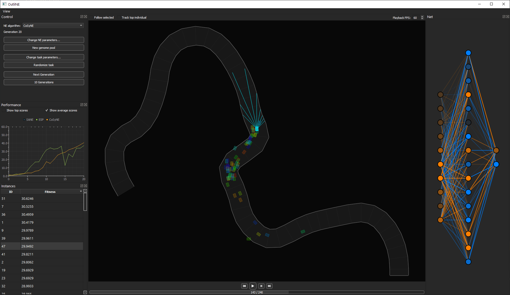

# OutliNE

OutliNE is a neuroevolution engine with a Qt5-based user interface.

It simulates a population of neural networks performing a task such as controlling a car on a racetrack based on distance sensors.
The agents are assigned a fitness value (distance along the track + penalty for crashing) and ranked accordingly.
The fittest individuals are recombined and mutated to form a new generation.
By repeating this process, the networks evolve to perform better and better at the task.

Neuroevolution works without the need for continuous reward signals, addressing one of the main limitations of reinforcement learning.

OutliNE is designed to be easily extensible with new environments and neuroevolution algorithms.
It currently supports three algorithms, SANE, ESP and CoSyNE.
These control how individuals are combined to form new networks.
All parameters of the NE algorithm and the environment can be freely adjusted.

It also features real-time visualizations of the agents in the environment as well as their neural networks.
